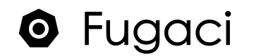

Fugaci is a tool that lets you run temporary macOS virtual machines (VMs) inside a Kubernetes cluster. Think of it as a bridge that connects the world of macOS applications with the powerful automation of Kubernetes.

Normally, Kubernetes is used for managing Linux containers. Fugaci extends this capability, allowing you to manage macOS workloads using the same familiar Kubernetes tools, like `kubectl`. It cleverly makes a Mac computer appear as a special "node" in your Kubernetes cluster, ready to run macOS-specific tasks.

#### Demo
[](https://www.youtube.com/watch?v=aNRD9s1ACAo)

#### Integration with Jenkins
[](https://www.youtube.com/watch?v=DbzaP82zl7c)

---

## A Building Block for macOS Workflows

Fugaci is designed to be a fundamental component, not a complete, all-in-one solution. Just as Kubernetes provides a powerful platform for building complex containerized systems, Fugaci provides the missing piece for managing temporary macOS environments within that platform. This allows developers and DevOps engineers to create custom, automated workflows for their specific macOS needs, such as building and testing iOS or macOS applications.

---

## Status

**🧪 Experimental**: Fugaci is currently in an experimental phase and is not recommended for production environments. However, it has been successfully used to run thousands of VMs for continuous integration (CI) purposes over several days.

---

## Features

-   **Ephemeral macOS VMs**: Automatically create and destroy macOS virtual machines as needed. This is great for one-off tasks like builds or tests, as it saves resources.
-   **Kubernetes Integration**: Manage your macOS VMs using the standard Kubernetes commands and tools you already know.
-   **Smart Scheduling**: Fugaci uses a Kubernetes feature called "taints" to ensure that only macOS-specific workloads are scheduled to run on your Mac hardware.
-   **Simple Deployment**: It's easy to install and run, distributed as a single file.

---

## Getting Started

### Prerequisites

Before you begin, you'll need the following:

-   **A macOS Host**: Fugaci needs to be installed on a Mac computer (like a Mac mini or Mac Studio). It's best if this machine is dedicated to running Fugaci, without other virtualization software like Docker Desktop or Parallels.
-   **Curie Binary**: Fugaci uses a separate tool called "[curie](https://github.com/macvmio/curie)" to handle the virtualization. You'll need to have this installed on your macOS host.
-   **A Kubernetes Cluster**: You need an existing Kubernetes cluster. The guide below shows how to set up a simple `k3s` (a lightweight Kubernetes distribution) cluster for this purpose.
-   **TLS Certificates**: For secure communication between Fugaci and the Kubernetes cluster, you'll need TLS security certificates. The instructions below cover how to generate these.

### Installation

#### 1. Set Up a Lightweight Kubernetes Cluster (k3s)

On a separate machine (or a VM that will act as your Kubernetes master), install `k3s`. You'll need to provide an IP address that your Fugaci node can use to communicate with it.

```bash
# Replace with the IP address of your k3s server
export FUGACI_K3S_SERVER_IP_ADDRESS="192.168.1.100"

# Install k3s
curl -sfL [https://get.k3s.io](https://get.k3s.io) | INSTALL_K3S_EXEC="server \
  --tls-san ${FUGACI_K3S_SERVER_IP_ADDRESS:?err} \
  --disable traefik \
  --disable-kube-proxy \
  --egress-selector-mode disabled" sh -
````

#### 2\. Configure `kubectl`

After `k3s` is installed, it will create a configuration file at `/etc/rancher/k3s/k3s.yaml`. Copy this file to your local machine, and edit it to replace the server IP address `127.0.0.1` with the `${FUGACI_K3S_SERVER_IP_ADDRESS}` you used above. This file allows `kubectl` to connect to your new cluster.

#### 3\. Download Fugaci and Curie

On your macOS host, download the latest release of Fugaci and install the `curie` binary.

```bash
# Download Fugaci from the latest release
curl -L -o /usr/local/bin/fugaci [https://github.com/macvmio/fugaci/releases/latest/download/fugaci](https://github.com/macvmio/fugaci/releases/latest/download/fugaci)
chmod +x /usr/local/bin/fugaci

# Make sure 'curie' is also installed, for example in /usr/local/bin/
# (Refer to the curie project for installation instructions)
```

#### 4\. Generate Security Certificates

For your Mac node (let's call it `m1`) to securely join the cluster, it needs a key and certificate. A helper script is provided in the [Fugaci repository](https://www.google.com/search?q=https://github.com/macvmio/fugaci) to make this easy.

```bash
# Clone the Fugaci repo to get the helper script
git clone [https://github.com/macvmio/fugaci.git](https://github.com/macvmio/fugaci.git)
cd fugaci

# Run the script from inside the repo with your node name and its IP address
./tools/generate-node-tls-certs.sh m1 <Fugaci Node IP address>
```

This will create `m1-crt.pem` and `m1-key.pem`. You will also need to copy the cluster's certificate authority file, located at `/var/lib/rancher/k3s/agent/client-ca.crt` on your `k3s` server, to your Fugaci node.

#### 5\. Configure Fugaci

Create a configuration file for Fugaci at `/etc/fugaci/config.yaml`. This file tells Fugaci where to find everything it needs.

```yaml
# A unique name for your Mac node in the Kubernetes cluster
nodeName: mac-m1

# Path to the kubeconfig file you configured in step 2
kubeConfigPath: /Users/your_username/.kube/config

# Where to store logs from the macOS VMs
containerLogsDirectory: /var/logs/fugaci 

# Settings for the 'curie' virtualization tool
curieVirtualization:
  binaryPath: /usr/local/bin/curie
  dataRootPath: /Users/your_username/.curie

# The IP address of this Mac node, must be reachable from `k3s` VM
internalIP: 192.168.1.99

# Paths to the security certificates you generated and copied
TLS:
  keyPath: /Users/your_username/.fugaci/m1-key.pem
  certPath: /Users/your_username/.fugaci/m1-crt.pem
  certificateAuthorityPath: /Users/your_username/.kube/client-ca.crt
```

**Note**: Make sure to replace `your_username` and the IP addresses with your actual information.

#### 6\. Start the Fugaci Daemon

Finally, bootstrap and start the Fugaci service. This command will set up Fugaci to run automatically in the background.

```bash
sudo /usr/local/bin/fugaci daemon bootstrap
```

-----

## Usage

Once Fugaci is running, your Mac will appear as a new node in your Kubernetes cluster. Fugaci applies a special **taint** to this node (`fugaci.macvm.io=true:NoSchedule`). This is a Kubernetes mechanism that prevents regular Linux workloads from being accidentally scheduled on your Mac.

To run a job on the Mac node, you need to add a corresponding **toleration** to your pod's configuration. This tells Kubernetes that your pod is "aware" of the taint and is allowed to run there.

### Example: Scheduling a macOS Pod

Here is a simple example of a Kubernetes pod designed to run a command inside a macOS VM.

```yaml
apiVersion: v1
kind: Pod
metadata:
  name: macos-workload
spec:
  # This selector tells Kubernetes to only schedule this pod on a node
  # that identifies as a 'darwin' (macOS) operating system.
  nodeSelector:
    kubernetes.io/os: darwin

  # This toleration allows the pod to be scheduled on the Fugaci node,
  # overriding the 'NoSchedule' taint.
  tolerations:
    - key: "fugaci.macvm.io"
      operator: "Equal"
      value: "true"
      effect: "NoSchedule"

  containers:
    - name: macos-container
      # This is the macOS VM image to run.
      image: ghcr.io/macvmio/macos-sonoma:14.5-agent-v1.6
      imagePullPolicy: IfNotPresent
      # This secret should contain SSH credentials (user/password)
      # that allow Kubernetes to execute commands inside the VM.
      envFrom:
        - secretRef:
            name: fugaci-ssh-secret
```
#### Verification

You can verify by running `kubectl exec --stdin --tty macos-workload -- /bin/bash` and typing `sw_vers`


-----

## License

Fugaci is licensed under the Apache License 2.0. You are free to use, modify, and distribute the software. See the [LICENSE](https://www.google.com/search?q=LICENSE) file for more details.

## Credits

Fugaci is developed and maintained by the team at [macvm.io](https://macvm.io). We welcome and appreciate contributions from the open-source community.
